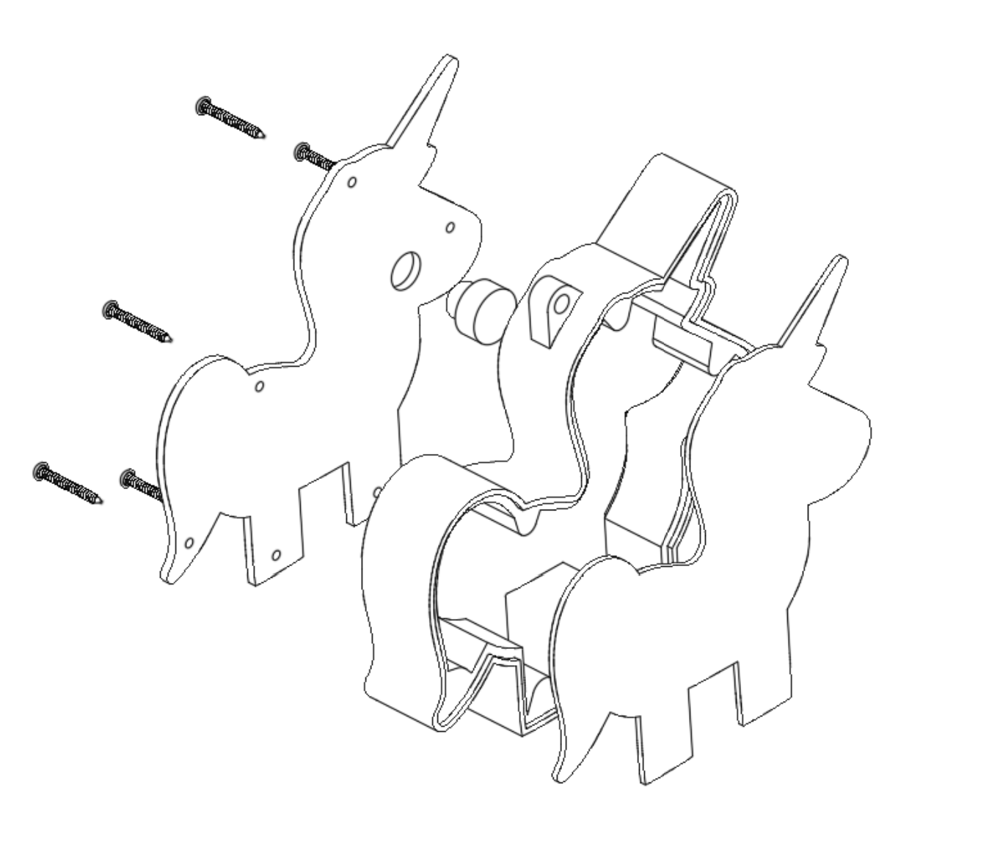
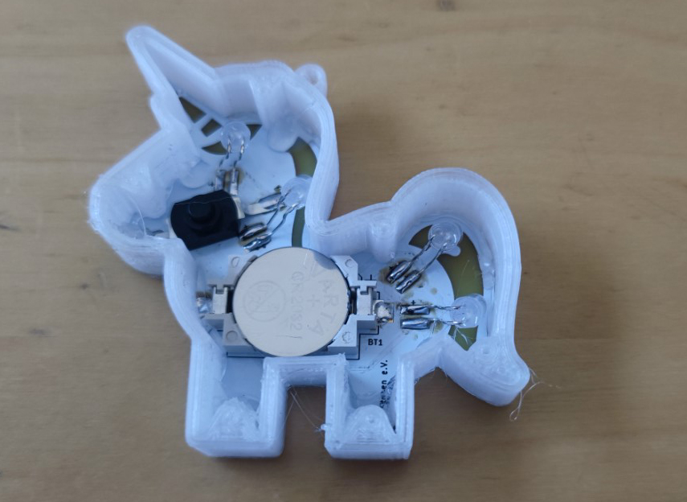
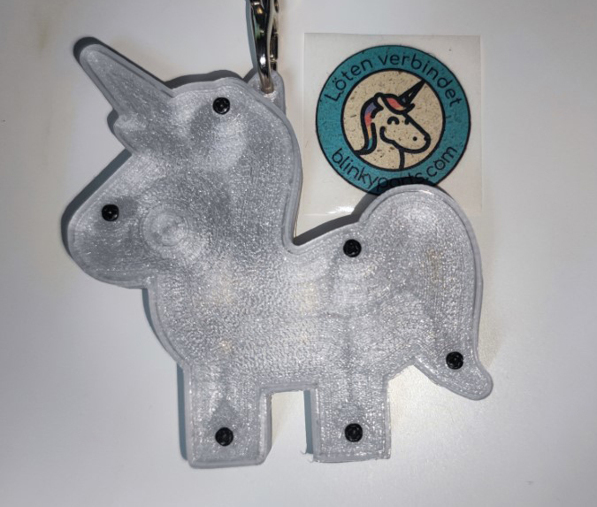

# Case

It is recommented to print this case with transparent PET filament.

## Things you'll need

* Transparent Filament
* 6 M1,7*6 screws
* Glue

## Assembly

First you'll need to print the three parts:

* Outer case
* Button
* Cover

I used generic PET filament at 235°C and a bed temperature of 75°C. Best is to place the case with the screw holes facing towards the build plate and adding a brim for more contact surface.

Then you can glue the PCB to the top part of the outer case. The top part does not have holes for the screws in it. I used hot glue, but the issue was, that the glue was getting hard too fast. I then heated up the PCB with my hot air gun to let the glue get soft again. After that I pressed the PCB and the case together. Maybe some other glue might work better.
With the PCB in place, just add place the button on top of the button on the PCB and carefully place the back cover on top of it. Fix the screws and your all set.

The result will look something like this:

