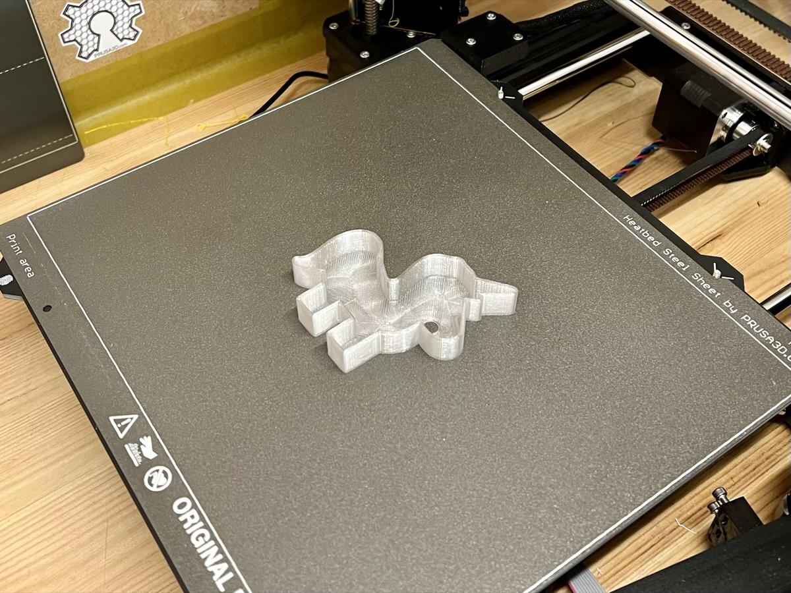
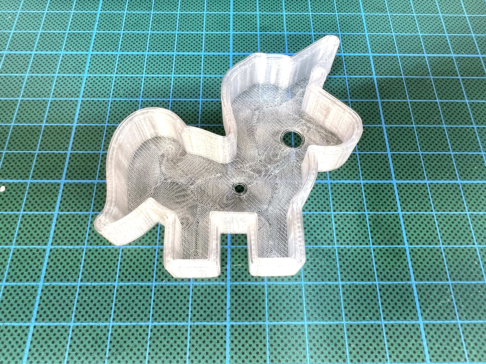

# Case

It is recommented to print this case with transparent PET filament.

There are two variants of the case:

* A case consisting of a frame that will be glued to the board, and a separate lid held in place by screws.
* A case consisting of a single body part only, where the board just snaps in. This one is a bit easier to print and assemble, but not quite as sturdy.

## Case with Separate Lid

### Things you'll need

* Transparent Filament
* 6 M1,7*6 screws
* Glue

### Assembly

First you'll need to print the three parts:

* Outer case
* Button
* Cover

I used generic PET filament at 235°C and a bed temperature of 75°C. Best is to place the case with the screw holes facing towards the build plate and adding a brim for more contact surface.

Then you can glue the PCB to the top part of the outer case. The top part does not have holes for the screws in it. I used hot glue, but the issue was, that the glue was getting hard too fast. I then heated up the PCB with my hot air gun to let the glue get soft again. After that I pressed the PCB and the case together. Maybe some other glue might work better.
With the PCB in place, just add place the button on top of the button on the PCB and carefully place the back cover on top of it. Fix the screws and your all set.

The result will look something like this:

## Snap-fit Case

### Things you'll need

* Transparent filament (preferably PET because it's a bit more flexible)

### Assembly

You need to print the body (either the version with or without hanger) and the button. Print the body with the bottom side facing the print plate (like shown in the photo above), this way no support material and no brim is needed. Use two separate print jobs for body and button if you want to make sure that there is no stringing.

Using the "0.30mm DRAFT" preset in Prusa Slicer seems to work well and results in a print time of about 45 minutes. (I used "concentric" infill for the bottom layer to give it a more interesting look, but of course any infill pattern will work.)

After the print has completed simply insert the button into the hole and then snap the board into place, using gentle force as needed. The fit is rather tight to make sure the board is held in place securely.

If you want to remove the board later just insert a toothpick into the small hole on the back and push the board out.
